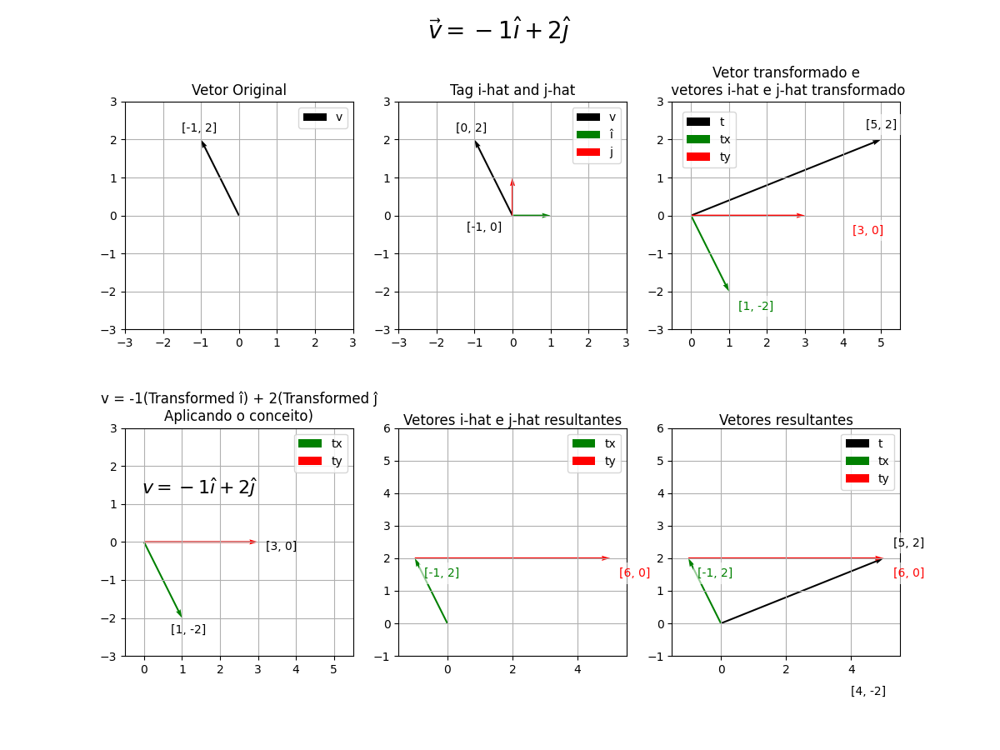

# Linear Algebra Visualizations

Visualizações interativas de conceitos de álgebra linear baseadas na série [3Blue1Brown - Essence of Linear Algebra](https://www.youtube.com/playlist?list=PLZHQObOWTQDPD3MizzM2xVFitgF8hE_ab).

## 🗂 Estrutura do Projeto

### [`basics/`](basics/)
Visualizações fundamentais de vetores:
- **`vetor_simples.py`** - Decomposição básica de vetores em componentes x e y
- **`vetor_decomposto.py`** - Comparação lado a lado entre vetor original e decomposto

### [`transformations/`](transformations/)
Transformações lineares e aplicações:
- **`vetor_decomposto_transformado.py`** - Como transformações lineares podem ser deduzidas acompanhando i-hat e j-hat

## 📊 Visualizações

### Vetor Simples

- Vetor `v = [-1, 2]` decomposto em componentes
- **vx** (verde): componente horizontal `[-1, 0]`
- **vy** (vermelho): componente vertical `[0, 2]`

### Vetor Decomposto

- **Left**: Vetor original `[-1, 2]`
- **Right**: Decomposição em componentes de base

### Transformação Linear

- Demonstra: `v = -1î + 2ĵ` → `v_transformado = -1(î_transformado) + 2(ĵ_transformado)`
- **î_transformado** = `[1, -2]`, **ĵ_transformado** = `[3, 0]`
- **Resultado**: `[5, 2] = -1×[1, -2] + 2×[3, 0]`

## 🚀 Como Usar

```bash
# Instalar dependências
pip install -r requirements.txt

# Executar exemplos
python basics/vetor_simples.py
python basics/vetor_decomposto.py
python transformations/vetor_decomposto_transformado.py

📚 Conceitos Demonstrados
Decomposição vetorial - Como vetores são quebrados em componentes de base

Transformações lineares - Seguindo i-hat e j-hat para deduzir qualquer transformação

Combinações lineares - Mantendo a mesma combinação após transformação

Bases coordenadas - Trabalhando com î e ĵ como vetores de base

🛠 Requisitos
Python 3.6+

NumPy

Matplotlib

Inspirado pela incrível série "Essence of Linear Algebra" do 3Blue1Brown


---

## **Para adicionar as imagens:**

Você precisa fazer upload das imagens para a raiz do repositório:

1. **Clique em "Add file" → "Upload files"**
2. **Arraste os 3 arquivos PNG:**
   - `vetor_simples.png`
   - `vetor_decomposto.png` 
   - `linear_transformation.png`
3. **Commit message:** `Add visualization screenshots`
4. **Marque:** "Commit directly to the main branch"

---

## **Estrutura final ficará assim:**


